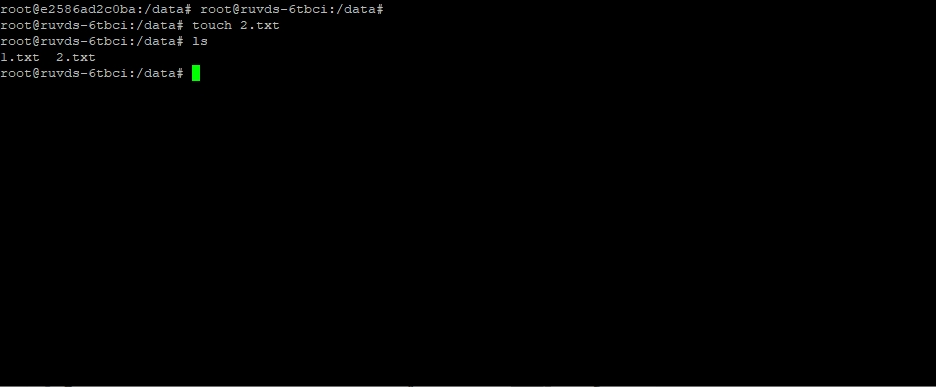
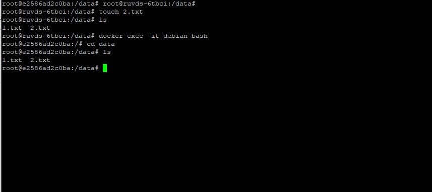

**Задача 2**

*     -Высоконагруженное монолитное java веб-приложение** - монолитное веб-приложение предполагает сборку всего в одном месте (frontend, backend, UI). 
Так как монолитное веб-приложение высоконагруженное, то стоит размещать или на физической среде, или использовать пара виртуализацию,     если накладными расходами можно пренебречь, однако контейнеризация не подойдет, так предполагается выполнение одного сервиса в рамках контейнера.
* 	-Node Js веб-приложение - контейнеризация подойдет для решения задачи
* 	- Мобильное приложение с версиями для Android и iOS - 	предполагается, что приложение имеет своего потребителя, 	а значит необходим UI для взаимодействия с пользователем. По моему мнению, 	корректнее всего использовать виртуализацию с реализацией виртуальной машины.
* 	- Шина данных на базе Apache Kafka - хорошо применить контейнеризацию, так как отсутствуют накладные расходы на виртуализацию, достигается простота масштабирования и управления. В данном случае необходима организация отказоустойчивости.
* Elasticsearch кластер для реализации логирования продуктивного веб-приложения - три ноды elasticsearch, два logstash и две ноды kibana - для упомянутых продуктов есть контейнеры на docker hub. Из-за простоты управления и сборки контейнеров, мне кажется необходимо распихать продукты по контейнерам и на основании контейнеров собрать кластер стека ELK.
* Мониторинг-стек на базе Prometheus и Grafana - по моему мнению также как и пример с ELK, скорее всего с течением времени будут вноситься изменения в систему мониторинга и не один раз, будут добавляется метрики, так как точки мониторинга будут меняться, контейнеризация помогает этого добиться.
* MongoDB, как основное хранилище данных для java-приложения - либо виртуализация, либо контейнеризация, все зависит от реализации архитектуры приложения. Разница вероятно всего в нагруженности сервиса при большой нагрузке лучше использовать виртуальную машину.
* Gitlab сервер для реализации CI/CD процессов и приватный (закрытый) Docker Registry - отдельный физический сервер или виртуализация и докер контейнер, если сервер есть в наличии использовал бы его, но только необходимо определить доступные объемы хранения данных. Докер позволит масштабировать решение, так же удобно обновлять приложение без большого простоя сервиса. Использование виртуальной машины позволит удобно администрировать сервис.

**Задача 3**

